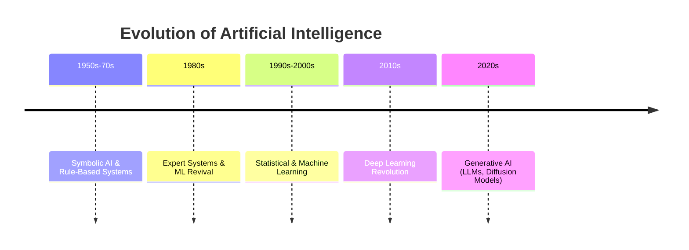
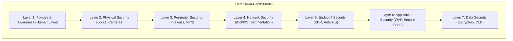

**Format:** Each question is answered in a concise, exam-ready style.

# One-mark Questions

**Q1. Define signature-based malware detection.**
**Answer:** A method that identifies threats by matching known patterns, such as byte sequences or cryptographic hashes, against a database of existing malware signatures.

**Q2. State one limitation of signature-based malware detection.**
**Answer:** It is unable to detect new, unknown (zero-day), or polymorphic malware that does not have a pre-existing signature.

**Q3. Identify one example where signature-based detection may fail.**
**Answer:** It fails against polymorphic malware, which alters its code with each infection to create a new, unrecognized signature.

**Q4. Define feature engineering.**
**Answer:** The process of using domain knowledge to select, transform, or create the most relevant input variables (features) from raw data to enhance the performance of machine learning models.

**Q5. Mention one advantage of behavior-based malware detection.**
**Answer:** It can detect previously unseen or zero-day malware by identifying malicious actions and patterns of behavior.

**Q6. Recall the type of dataset that is required for supervised learning.**
**Answer:** A labeled dataset, where each data sample is tagged with a correct output or target label.

**Q7. Identify the type of problems for which Logistic Regression is mainly used.**
**Answer:** Binary classification problems, where the outcome has two possible classes (e.g., 'malicious' or 'benign').

**Q8. Differentiate between malware and ransomware.**
**Answer:** Malware is a broad term for any malicious software. Ransomware is a specific type of malware that encrypts a victim's files and demands a ransom payment for their decryption.

**Q9. Expand SVM.**
**Answer:** Support Vector Machine.

**Q10. Define ransomware.**
**Answer:** A type of malicious software designed to block access to a computer system or its data, typically by encryption, until a sum of money is paid.

**Q11. Name two Artificial Neural Networks used in cyber security.**
**Answer:** Convolutional Neural Networks (CNNs) and Recurrent Neural Networks (RNNs).

**Q12. Define malware.**
**Answer:** Software intentionally designed to disrupt a computer or network, leak private information, or gain unauthorized access to systems.

**Q13. State one example of an internal cyber threat.**
**Answer:** A disgruntled employee with authorized access deliberately stealing and leaking confidential company data.

**Q14. Define phishing attack.**
**Answer:** A social engineering attack where attackers deceive people into revealing sensitive information, such as login credentials, via fraudulent emails or websites.

**Q15. Mention one use of Decision Trees in malware classification.**
**Answer:** Decision Trees can classify a file as malicious or benign by creating a model of rules based on its features, such as the presence of certain API calls or specific file header information.

**Q16. State one challenge in supervised malware detection.**
**Answer:** Concept drift, where malware constantly evolves, causing the patterns learned by the model to become outdated and less effective over time.

**Q17. Discuss one difference between a Trojan and a Worm.**
**Answer:** A Trojan requires user interaction to execute and disguises itself as a legitimate program, whereas a worm can self-replicate and spread across networks without human intervention.

**Q18. Recognize two types of regression techniques.**
**Answer:** Two common regression techniques are Linear Regression and Polynomial Regression.

**Q19. Recall one benefit of using Deep Learning in phishing detection.**
**Answer:** Deep learning models can automatically identify complex patterns from raw data, such as the visual layout of a webpage or the semantic meaning in an email, to detect sophisticated phishing attempts.

**Q20. Identify one example of malware that can bypass signature-based detection method.**
**Answer:** Metamorphic malware, which can completely rewrite its own code with each new infection, can effectively bypass signature-based detection.

**Q21. Define feature engineering.**
**Answer:** The process of using domain knowledge to select, transform, or create the most relevant input variables (features) from raw data to enhance the performance of machine learning models.

**Q22. Recall the detection method that depends on known malware patterns.**
**Answer:** Signature-based detection is the method that relies on a database of known malware patterns or signatures.

**Q23. Identify the learning approach that requires labeled data.**
**Answer:** Supervised learning is the machine learning approach that requires labeled data for training.

**Q24. Identify which approach (supervised/unsupervised) is better for detecting unknown malware.**
**Answer:** Unsupervised learning (specifically anomaly detection) is generally better for detecting unknown (zero-day) malware as it identifies deviations from normal behavior without prior knowledge of specific threats.

**Q25. Mention one use case of ML in cybersecurity.**
**Answer:** A key use case is in Network Intrusion Detection Systems (NIDS), where machine learning models analyze network traffic to identify anomalous patterns indicative of an attack.

**Q26. Express the meaning of dimensionality reduction.**
**Answer:** Dimensionality reduction is the process of reducing the number of input variables (features) in a dataset while preserving as much of the important information as possible.

**Q27. Interpret the meaning of Cyber Threat Landscape.**
**Answer:** The Cyber Threat Landscape refers to the entire range of existing, emerging, and potential cyber threats, attack vectors, and malicious actors that could pose a risk to an individual or organization.

**Q28. Distinguish Linear regression and Logistic regression by mentioning one point.**
**Answer:** Linear regression is used to predict a continuous output value (e.g., price), while logistic regression is used to predict a categorical outcome or probability (e.g., malicious/benign).

**Q29. Criticize one aspect of using Logistic Regression for cybersecurity.**
**Answer:** While widely used, Logistic Regression's primary limitation is that it creates a linear decision boundary, making it less effective at modeling the complex, non-linear patterns often found in sophisticated cyber attacks without extensive feature engineering.

**Q30. Examine which approach is more effective against zero-day malware: signature-based or behavior-based.**
**Answer:** Behavior-based detection is more effective against zero-day malware because it focuses on identifying suspicious actions and runtime behavior rather than relying on pre-existing signatures.

---

# Five-mark Questions

**Q31. Recall the evolution of AI with a suitable diagram and explanation.**
**Answer:**
The evolution of AI has progressed from logic-based systems to data-driven deep learning.

**Key Milestones:**
-   **1950s-1970s (The Birth of AI):** Focus on symbolic reasoning and rule-based systems (e.g., Logic Theorist). Early work on neural networks began.
-   **1980s (Expert Systems & ML Revival):** Rise of knowledge-based expert systems. The rediscovery of backpropagation revived interest in neural networks.
-   **1990s-2000s (Statistical Learning):** Shift towards statistical, data-driven approaches like Support Vector Machines (SVMs) and Random Forests.
-   **2010s-Present (The Deep Learning Revolution):** Dominated by deep neural networks, fueled by big data and powerful GPUs, leading to breakthroughs in image, speech, and language understanding.
-   **2020s (Generative AI):** Emergence of powerful generative models like Large Language Models (LLMs) and diffusion models, capable of creating novel content.

**Diagram (Timeline):**

**Explanation:** AI evolved from rigid, handcrafted logic systems to flexible, data-driven learning models. Early AI focused on emulating human reasoning with rules. The machine learning era shifted this to learning patterns from data. The latest wave, deep learning, uses complex neural networks to learn hierarchical representations from massive datasets, enabling advanced capabilities like generative models.

**Q32. Explain narrow AI and Generative AI by mentioning their prominent functionalities.**
**Answer:**
**Narrow AI (Artificial Narrow Intelligence - ANI):**
Also known as Weak AI, Narrow AI is designed and trained to perform a single, specific task or a very limited range of tasks. It operates within a predefined context and cannot perform functions beyond its specialty.
-   **Prominent Functionalities:** Classification (spam filters), recommendation engines (Netflix, Amazon), image recognition (tagging photos), and natural language processing for specific commands (Siri, Alexa).

**Generative AI:**
A branch of AI that focuses on creating new, original content (text, images, code, music) by learning the underlying patterns and structures of the data it was trained on.
-   **Prominent Functionalities:** Content creation (generating articles, art), data augmentation (creating synthetic data to train other models), code generation, and media synthesis (creating deepfakes, music, or audio).

**Q33. Explain how AI can be applied in phishing detection.**
**Answer:**
AI enhances phishing detection by analyzing multiple facets of an email and its destination, moving beyond simple keyword matching.
1.  **Natural Language Processing (NLP):** AI models analyze the email text to detect social engineering cues like a sense of urgency, unusual grammar, suspicious requests for credentials, and topic anomalies inconsistent with the supposed sender.
2.  **URL and Link Analysis:** Machine learning scrutinizes URLs for malicious features, such as domain age, character entropy (randomness), and lexical similarity to legitimate domains (detecting typosquatting).
3.  **Visual Analysis:** Computer vision models (like CNNs) can visually compare a destination webpage's layout and logo to the legitimate site it impersonates, detecting pixel-perfect clones even on newly created domains.
4.  **Sender and Header Analysis:** AI builds reputation scores for senders based on historical data and analyzes email headers for signs of spoofing or routing through suspicious servers.
5.  **Behavioral Anomaly Detection:** AI can model a user's or organization's normal communication patterns and flag emails that are anomalous, such as a first-time financial request from an executive to a junior employee.

**Q34. Explain Active and Passive attacks with suitable discussion.**
**Answer:**
**Passive Attacks:** The adversary observes or monitors information from the system without altering system resources or data. The primary goal is to breach **confidentiality**.
-   **Examples:** Eavesdropping on unencrypted network traffic (wiretapping), traffic analysis (monitoring the frequency and size of messages).
-   **Discussion:** These attacks are very difficult to detect because they do not change the system's state. The primary defense against them is prevention, mainly through strong encryption of data in transit and at rest.

**Active Attacks:** The adversary actively attempts to alter data, affect system operations, or modify system resources. The goal is to breach **integrity**, **availability**, or **authenticity**.
-   **Examples:** Denial-of-Service (DoS), Man-in-the-Middle (MitM), replay attacks, and malware infections.
-   **Discussion:** These attacks are generally easier to detect than passive attacks because they create changes in system state, logs, or network traffic that can be identified by Intrusion Detection Systems (IDS). Defenses focus on a combination of prevention (authentication, access control) and detection/response.

**Q35. Review phishing attacks, and mention different types of phishing attacks.**
**Answer:**
A phishing attack is a form of cybercrime where an attacker, posing as a legitimate institution or individual, uses fraudulent communications (email, SMS, phone calls) to trick victims into providing sensitive data, such as login credentials, credit card numbers, or personal information.
**Types of Phishing Attacks:**
-   **Spear Phishing:** A highly targeted attack aimed at a specific individual, group, or organization, often using personalized information to increase credibility.
-   **Whaling:** A type of spear phishing that specifically targets high-profile executives or senior management within a company.
-   **Clone Phishing:** An attack where a legitimate, previously delivered email is duplicated and modified to include malicious links or attachments, then sent from an email address spoofing the original sender.
-   **Vishing / Smishing:** Phishing conducted over non-email channels. **Vishing** uses voice calls (Voice Phishing), while **Smishing** uses SMS text messages (SMS Phishing).
-   **Business Email Compromise (BEC):** A sophisticated scam targeting businesses, often involving impersonation of a senior executive or a vendor to authorize fraudulent wire transfers or payments.

**Q36. Explain CIA in cyber security.**
**Answer:**
The CIA Triad is a foundational model for guiding information security policy and practice. It comprises three core principles:
-   **Confidentiality:** Ensures that sensitive information is not disclosed to unauthorized individuals, entities, or systems. It is about protecting privacy and secrecy.
    -   **Controls:** Encryption, access control lists (ACLs), and data classification.
-   **Integrity:** Ensures that data is trustworthy and has not been altered or destroyed in an unauthorized or undetected manner. It maintains the accuracy and completeness of data.
    -   **Controls:** Hashing algorithms (e.g., SHA-256), digital signatures, and version control.
-   **Availability:** Ensures that information, systems, and resources are accessible and usable when needed by authorized users. It protects against disruption of service.
    -   **Controls:** Redundancy (RAID, server clusters), disaster recovery plans, backups, and DDoS mitigation.

**Q37. Illustrate how machine learning helps in identifying ransomware.**
**Answer:**
Machine learning identifies ransomware primarily through real-time, behavior-based detection, which is effective even against unknown (zero-day) variants.
1.  **Baseline Modeling:** An ML model first learns a baseline of normal system and file activity on an endpoint. This includes typical file I/O operations, API calls, and network traffic patterns.
2.  **Feature Monitoring for Ransomware Indicators:** The model continuously monitors for a combination of malicious behaviors that, when seen together, strongly indicate a ransomware attack. Key features include:
    -   **Rapid File Encryption:** A high volume of file read/write/rename operations in a short period across many files.
    -   **High-Entropy Writes:** Writing data with high randomness (entropy), a statistical signature of encrypted content.
    -   **Deletion of Backups:** Making API calls to delete Volume Shadow Copies or other system backups to prevent recovery.
    -   **Creation of Ransom Notes:** Dropping text or HTML files with characteristic ransom instructions in multiple directories.
    -   **C2 Communication:** Unusual network connections to command-and-control servers.
3.  **Anomaly Detection and Automated Response:** When the model detects a severe deviation from the baseline composed of these malicious indicators, it flags the process as ransomware. An ML-powered Endpoint Detection and Response (EDR) agent can then automatically terminate the malicious process and isolate the host from the network to prevent lateral spread, all before significant damage occurs.

**Q38. Explain the difference between signature-based and behavior-based malware detection.**
**Answer:**

| Feature                | Signature-Based Detection                                   | Behavior-Based Detection                                    |
| :--------------------- | :---------------------------------------------------------- | :---------------------------------------------------------- |
| **Detection Method**   | Matches static patterns (file hashes, byte sequences) against a database of known malware. | Monitors the runtime actions and behaviors of a program (API calls, file changes, network activity). |
| **Primary Target**     | Effective against **known** malware with existing signatures. | Effective against **unknown** (zero-day) and polymorphic malware. |
| **Analysis Type**      | **Static Analysis:** The file is analyzed without being executed. | **Dynamic Analysis:** The program is observed as it runs (often in a sandbox). |
| **Key Weakness**       | Fails against new or slightly modified threats where the signature is different. | Can have a higher rate of false positives and requires more system resources to operate. |
| **Analogy**            | Matching a criminal's fingerprint against a police database. | Identifying a criminal by observing their suspicious actions (e.g., trying to pick a lock). |

**Q39. Discuss Zero-Day Exploitation in cyber security, also mention its Preventive & Defensive Strategies briefly.**
**Answer:**
A **Zero-Day Exploitation** is a cyber attack that targets a previously unknown software vulnerability. It is called "zero-day" because the software vendor has had zero days to create a patch or defense, making these attacks highly effective. The exploit is the method or code used to take advantage of the vulnerability.

**Preventive & Defensive Strategies:**
-   **Behavior-Based Detection:** Using tools like Endpoint Detection and Response (EDR) to identify anomalous behavior resulting from an exploit, rather than the exploit itself. For example, detecting a PowerShell script spawning from Microsoft Word.
-   **Attack Surface Reduction:** Minimizing potential entry points by hardening systems, disabling unnecessary services, and applying the principle of least privilege to limit what an attacker can do if they gain a foothold.
-   **Virtual Patching:** Using an Intrusion Prevention System (IPS) or a Web Application Firewall (WAF) to inspect network traffic and block patterns that attempt to trigger the vulnerability, effectively creating a "patch" at the network level.
-   **Sandboxing and Isolation:** Executing suspicious files, email attachments, or web content in an isolated environment (a sandbox) to observe their behavior safely before they can access the production network.
-   **Defense-in-Depth:** Employing multiple layers of security controls (e.g., firewalls, EDR, application control, user training) so that if one layer fails to stop the zero-day attack, another may succeed.

**Q40. Explain Ransomware attack and its' possible preventive measures.**
**Answer:**
A **Ransomware Attack** is a type of malicious attack where malware encrypts a victim's data, rendering it inaccessible. The attackers then demand a ransom payment, usually in cryptocurrency, in exchange for the decryption key. Modern ransomware attacks often employ a "double extortion" tactic, where they also exfiltrate (steal) sensitive data before encryption and threaten to leak it publicly if the ransom is not paid.

**Preventive Measures:**
-   **Regular and Immutable Backups:** This is the most critical defense. Follow the 3-2-1 backup rule (3 copies, on 2 different media, with 1 offsite). Ensure at least one copy is offline or immutable so it cannot be encrypted by the ransomware.
-   **Security Awareness Training:** Educate users to recognize and report phishing emails, which are the primary delivery vector for ransomware.
-   **Robust Patch Management:** Promptly apply security patches to operating systems, applications (especially browsers and email clients), and network devices to close vulnerabilities that ransomware can exploit.
-   **Endpoint Detection and Response (EDR):** Use modern security tools that employ behavior-based detection to identify and block ransomware activity in real-time before encryption completes.
-   **Principle of Least Privilege and Network Segmentation:** Limit user access rights to only what is necessary for their job. Segment the network to prevent ransomware from spreading laterally from one compromised machine to the entire organization.

**Q41. Illustrate why dimensionality reduction is important in cybersecurity datasets.**
**Answer:**
Dimensionality reduction is critical when working with cybersecurity datasets for several key reasons:
-   **Combating the Curse of Dimensionality:** Security datasets, such as network flow logs or system event logs, can have hundreds or thousands of features. In such high-dimensional spaces, data becomes sparse, making it difficult for machine learning models to find meaningful patterns and increasing the risk of overfitting.
-   **Improved Model Performance and Speed:** Reducing the number of features significantly speeds up model training and prediction times. It can also improve model accuracy by removing noisy, irrelevant, and redundant features, allowing the model to focus on the most impactful signals.
-   **Removal of Redundancy (Multicollinearity):** Many features in security datasets are highly correlated (e.g., bytes sent and packets sent). Techniques like Principal Component Analysis (PCA) create new, uncorrelated components, which helps stabilize models like linear and logistic regression.
-   **Enhanced Data Visualization and Interpretability:** It is impossible to visualize data in hundreds of dimensions. Dimensionality reduction techniques can project the data down into 2D or 3D, allowing security analysts to visually explore the data, identify clusters of activity, and spot anomalies that might represent an attack.

**Q42. Demonstrate the 7 Layers of Cybersecurity.**
**Answer:**
The 7-layer cybersecurity model is a conceptual framework for implementing a defense-in-depth strategy, where multiple security controls are layered to protect an organization's assets. While specific models may vary, a common representation is:
1.  **Policies, Procedures & Awareness:** The human layer. This includes security governance, risk management policies, and security awareness training for all employees. It is the foundation of the entire security posture.
2.  **Physical Security:** Controls that protect the physical environment where IT infrastructure resides. This includes locks, fences, security guards, and surveillance cameras.
3.  **Perimeter Security:** The network edge where the internal network connects to the internet. This layer is secured by firewalls, VPN gateways, and perimeter Intrusion Detection Systems (IDS).
4.  **Network Security:** Securing the internal network from threats that have bypassed the perimeter. This involves internal network segmentation, Intrusion Prevention Systems (IPS), and access control lists (ACLs).
5.  **Endpoint Security:** Protecting the individual devices connected to the network (laptops, servers, mobile phones). This layer includes next-gen antivirus (NGAV), Endpoint Detection and Response (EDR), and host-based firewalls.
6.  **Application Security:** Securing the software and applications running on the endpoints and servers. This involves secure coding practices, vulnerability scanning, and Web Application Firewalls (WAFs).
7.  **Data Security:** The core of the model, focused on protecting the data itself. This layer includes data encryption (at rest and in transit), Data Loss Prevention (DLP) tools, and robust access management.

**Q43. Explain supervised learning in the context of malware classification.**
**Answer:**
Supervised learning for malware classification involves training a machine learning model on a pre-labeled dataset to learn how to distinguish between malicious and benign files.
The process is as follows:
1.  **Data Collection and Labeling:** A large dataset of files is gathered. Each file is carefully analyzed and labeled by experts as either 'malware' or 'benign'. This labeled dataset serves as the "ground truth" for training.
2.  **Feature Extraction:** Raw files are converted into numerical feature vectors that the model can understand. These features can be:
    *   **Static:** Extracted without running the file (e.g., file size, entropy, imported libraries, string signatures).
    *   **Dynamic:** Extracted by running the file in a sandbox (e.g., API calls made, network connections, registry keys modified).
3.  **Model Training:** A supervised learning algorithm (e.g., SVM, Decision Tree, Random Forest) is fed the feature vectors and their corresponding labels. The algorithm learns the patterns and relationships in the features that differentiate malware from benign files.
4.  **Evaluation:** The trained model's performance is tested on a separate, unseen portion of the labeled dataset (the test set). Its effectiveness is measured using metrics like accuracy, precision, recall, and F1-score.
5.  **Deployment:** Once validated, the model is deployed in a security tool (like an antivirus engine) to classify new, unknown files it has never seen before.

**Q44. Analyze the Logistic Regression method used in the Malware classification process.**
**Answer:**
Logistic Regression is a fundamental supervised algorithm used for binary classification, making it a suitable baseline model for distinguishing between 'malicious' and 'benign' files.
**Analysis:**
-   **How it Works:** It models the probability that a given file belongs to a particular class. It takes a linear combination of input features and passes it through a sigmoid function, which outputs a value between 0 and 1. A threshold (typically 0.5) is then used to classify the file as malicious or benign.
-   **Strengths:**
    -   **Interpretability:** The model's coefficients provide a clear understanding of how each feature (e.g., high file entropy, presence of a specific API call) influences the prediction. This is highly valuable for security analysts.
    -   **Efficiency:** It is computationally lightweight, fast to train, and requires relatively few resources, making it excellent for initial analysis or as a baseline to compare against more complex models.
-   **Weaknesses:**
    -   **Linearity Assumption:** Its primary drawback is that it assumes a linear relationship between the features and the outcome. It creates a linear decision boundary, which is often too simple to capture the complex, non-linear patterns presented by modern, sophisticated malware.
    -   **Performance on Complex Data:** It is frequently outperformed by more complex models like Random Forests, Gradient Boosting Machines, or Neural Networks on challenging malware classification tasks that require modeling intricate feature interactions. It often requires significant manual feature engineering to be effective.

**Q45. Analyze the limitations of supervised learning models in cybersecurity.**
**Answer:**
Supervised learning models, while powerful, have several key limitations in the dynamic and adversarial cybersecurity domain:
-   **Requirement for Labeled Data:** Obtaining large, high-quality, and accurately labeled datasets of malware is extremely expensive, time-consuming, and requires significant domain expertise. Labeling errors can severely degrade model performance.
-   **Inability to Detect Novel Attacks:** By design, supervised models can only identify patterns they have seen during training. This makes them inherently ineffective against new, zero-day threats for which no labels exist.
-   **Concept Drift:** The threat landscape evolves constantly (e.g., new malware families, new attack techniques). A model trained on past data will see its performance degrade over time as attack patterns "drift," requiring constant retraining.
-   **Vulnerability to Adversarial Attacks:** Attackers can intentionally craft adversarial examples—malware samples with subtle modifications invisible to humans—that are specifically designed to be misclassified by the AI model, allowing the malware to evade detection.
-   **Class Imbalance Problem:** In real-world security data, malicious samples are typically very rare compared to benign samples (e.g., one malicious packet in millions). This imbalance can cause the model to become biased towards the majority class (benign) and perform poorly at detecting the crucial minority class (malicious).

---

# Ten-mark Questions

**Q61. Recall five AI-related Technologies used in Cybersecurity.**
**Answer:**
1.  **Machine Learning (ML) / Deep Learning (DL):** This is the foundational technology.
    *   **ML** algorithms (like Random Forest, SVM) are used for predictive analytics in tasks like network intrusion detection, spam filtering, and fraud detection by learning from structured feature data.
    -   **DL**, a subfield of ML using deep neural networks, excels at learning complex patterns directly from raw data. It is used for advanced malware detection (analyzing sequences of API calls with RNNs or entire file binaries as images with CNNs) and visual phishing detection.
2.  **Natural Language Processing (NLP):** This technology enables computers to understand and process human language. In cybersecurity, it is used to:
    -   Analyze email content for social engineering cues (urgency, threats) to detect phishing.
    -   Parse unstructured threat intelligence reports and security blogs to automatically extract Indicators of Compromise (IoCs).
    -   Monitor dark web forums and hacker chatter for emerging threats.
3.  **Anomaly Detection (Unsupervised Learning):** This approach identifies data points or events that deviate significantly from a learned baseline of normal behavior, without needing pre-labeled data. It is crucial for:
    -   Detecting zero-day threats and novel malware that have no known signature.
    -   Powering User and Entity Behavior Analytics (UEBA) systems to spot insider threats or compromised accounts by detecting abnormal user activity (e.g., logging in at an unusual time, accessing sensitive files).
4.  **Generative AI:** These are models that create new, synthetic content.
    -   **Defensive Use:** Used for data augmentation, where synthetic malware or network attack data is generated to train and improve the robustness of detection models, especially for rare attack types.
    -   **Offensive Use:** Used by criminals to generate highly convincing, personalized spear-phishing emails, create polymorphic malware that constantly changes its code, and produce deepfake audio/video for sophisticated social engineering attacks.
5.  **Security Orchestration, Automation, and Response (SOAR):** While not purely an AI technology, modern SOAR platforms heavily integrate AI and ML to enhance their capabilities. AI is used to:
    -   **Triage Alerts:** Automatically analyze and prioritize the flood of security alerts, filtering out false positives.
    -   **Automate Response:** Trigger automated response playbooks based on the nature of a threat, such as isolating an infected endpoint or blocking a malicious IP address, enabling responses at machine speed.

**Q62. How can AI improve phishing email detection? Support your answer with case examples.**
**Answer:**
AI dramatically improves phishing detection by moving beyond static, rule-based filters (like blacklisted keywords or domains) to a dynamic, context-aware, and multi-layered analysis of threats.

**Mechanisms for Improvement & Case Examples:**

1.  **Deep Content and Intent Analysis (NLP):** AI using Natural Language Processing can understand the *intent* and *context* of language, not just keywords. It detects subtle social engineering cues, urgency ("action required immediately"), unusual writing styles, and requests that are contextually inappropriate.
    -   **Case Example:** **Google's Gmail** uses TensorFlow-based models that analyze thousands of signals in real time. For Business Email Compromise (BEC) detection, it can identify that an email *claiming* to be from the CEO has a writing style and sentence structure inconsistent with the CEO's previous emails, even if no malicious link is present.

2.  **Advanced URL and Website Visual Analysis:** AI models scrutinize URLs for sophisticated signs of maliciousness beyond just the domain name. Furthermore, computer vision models can analyze the visual appearance of a destination webpage.
    -   **Case Example:** **Microsoft Defender for Office 365** uses a feature called "Safe Links." When a user clicks a link, AI detonates the URL in a secure sandbox environment. It analyzes the destination page's behavior and uses computer vision to compare its visual layout, logo, and form fields to the legitimate site it's impersonating. This detects pixel-perfect credential harvesting pages even on brand-new, never-before-seen domains.

3.  **Sender Reputation and Behavioral Anomaly Detection:** AI builds dynamic profiles of communication patterns within an organization and with external partners. It can flag emails that are anomalous to these established patterns.
    -   **Case Example:** **Proofpoint's Email Protection** utilizes machine learning to build a "social graph" of communications. If an email arrives that claims to be from a known business partner but originates from a new, unseen IP address or has an unusual email header structure, the AI assigns it a high threat score and may quarantine it, recognizing the deviation from the partner's normal communication fingerprint.

4.  **Hybrid Threat Correlation:** AI can correlate data from multiple sources (email, web, endpoint) to identify a coordinated attack. An email that appears benign on its own might be flagged as malicious if the embedded link leads to a domain that was just registered and is hosted on an IP address known for malicious activity.

**Q63. Discuss Support Vector Machines (SVM) for malware detection with examples.**
**Answer:**
Support Vector Machines (SVM) are a powerful supervised learning algorithm effective for classification tasks, including malware detection. The core idea of SVM is to find an optimal hyperplane that separates data points of different classes in a high-dimensional space with the maximum possible margin.

**How SVM Works:**
-   **Hyperplane and Margin:** In a dataset, SVM identifies a decision boundary (a hyperplane) that doesn't just separate the two classes (malicious vs. benign) but also stays as far away from the closest data points of any class as possible. This distance is called the margin. A larger margin leads to better generalization and a more robust classifier.
-   **Support Vectors:** These are the data points that lie closest to the hyperplane and are critical in defining its position and orientation. If these points were moved, the hyperplane would also move.
-   **The Kernel Trick:** Real-world data is rarely perfectly separable by a straight line. The "kernel trick" is a key feature of SVM that allows it to handle non-linearly separable data. It does this by mapping the data into a higher-dimensional space where a linear separation becomes possible, without having to explicitly compute the coordinates in that new space. Common kernels include the Radial Basis Function (RBF), Polynomial, and Sigmoid kernels.

**Examples in Malware Detection:**
-   **Static Feature Analysis (n-grams):**
    1.  **Feature Extraction:** An executable file is read as a sequence of bytes. The frequency of short byte sequences (n-grams, e.g., 'E8 00 00 00 00') is counted for thousands of files, creating a high-dimensional feature vector for each file.
    2.  **SVM Training:** An SVM model is trained on these labeled vectors. It learns the optimal hyperplane that separates the n-gram patterns typical of known malware from those of benign software. For instance, malware might frequently use certain n-grams related to packing or obfuscation routines.

-   **Dynamic Feature Analysis (API Call Sequences):**
    1.  **Feature Extraction:** A file is executed in a sandbox, and its behavior is recorded. The features could be the frequency counts of specific Windows API calls made by the program (e.g., `CreateRemoteThread`, `RegSetValue`, `DeleteFile`).
    2.  **SVM Training:** The SVM is trained on these behavioral feature vectors. It learns to identify patterns of API calls that are indicative of malicious behavior, such as a combination of file encryption calls (`WriteFile`), network communication calls (`InternetOpen`), and self-deletion calls. The SVM with an RBF kernel can effectively model complex, non-linear combinations of these behaviors.

**Pros/Cons in Cybersecurity:**
-   **Pros:** Highly effective in high-dimensional spaces (common with security features), robust against overfitting due to margin maximization.
-   **Cons:** Can be slow to train on very large datasets, and the results can be less interpretable ("less of a white box") than models like Decision Trees.

**Q64. Discuss five types of Cyber Threats with brief details of each.**
**Answer:**
1.  **Malware (Malicious Software):** A broad category of software intentionally designed to cause damage to a computer, server, client, or computer network. It is a catch-all term for various malicious programs.
    -   **Details:** Subtypes include **Viruses** (attach to clean files and spread), **Worms** (self-replicating and spread across networks independently), **Trojans** (disguise as legitimate software to trick users into installing them), **Ransomware** (encrypts data and demands a ransom), and **Spyware** (secretly gathers information about the user).
2.  **Phishing and Social Engineering:** Social engineering is the art of manipulating human psychology to trick victims into divulging sensitive information or performing actions that compromise security. Phishing is the most common form of social engineering.
    -   **Details:** Phishing attacks use fraudulent emails, SMS messages (Smishing), or voice calls (Vishing) that appear to be from a reputable source. The goal is to steal credentials, install malware, or initiate fraudulent financial transactions. Spear phishing targets specific individuals with personalized messages.
3.  **Denial-of-Service (DoS/DDoS) Attacks:** An attack designed to make a machine or network resource unavailable to its intended users by overwhelming it with a flood of internet traffic.
    -   **Details:** A **DoS** attack originates from a single source. A **Distributed Denial-of-Service (DDoS)** attack is launched from multiple compromised devices (a "botnet"), making it much harder to block. The goal is not to steal data but to disrupt service availability.
4.  **Man-in-the-Middle (MitM) Attacks:** An attack where the adversary secretly intercepts and relays communication between two parties who believe they are directly communicating with each other.
    -   **Details:** The attacker places themselves between the user and a legitimate service, allowing them to eavesdrop on, capture, or alter the communication. These attacks are common on unsecured public Wi-Fi networks and can be used to steal login credentials, credit card numbers, or inject malware into traffic.
5.  **Insider Threats:** A security threat that originates from within the targeted organization. This can be a current or former employee, contractor, or business partner with legitimate access to the organization's systems or data.
    -   **Details:** Insider threats can be **malicious** (a disgruntled employee intentionally stealing data or sabotaging systems) or **negligent** (an employee accidentally exposing data through carelessness, like losing a company laptop or falling for a phishing scam). They are often harder to detect than external threats because the activity may appear legitimate.

**Q65. Explain five types of impact of Cyber Threats with brief details of each.**
**Answer:**
1.  **Direct Financial Loss:** This is the most immediate and tangible impact. It includes the direct theft of funds from bank accounts, fraudulent transactions, the cost of paying a ransom, and expenses related to remediation and recovery, such as hiring forensic experts and replacing compromised hardware.
2.  **Reputational Damage:** A public security breach can severely damage an organization's brand and erode the trust of its customers, partners, and investors. This loss of confidence can lead to customer churn, a decline in stock price, and difficulty attracting new business, resulting in long-term revenue loss that can far exceed the initial financial costs of the breach.
3.  **Operational Disruption:** Cyber attacks like ransomware or DDoS can bring business operations to a complete halt. This leads to lost productivity, an inability to provide services to customers, missed sales opportunities, and potential violations of service-level agreements (SLAs) with clients, which can incur contractual penalties.
4.  **Legal and Regulatory Penalties:** Organizations that fail to protect sensitive data can face severe consequences from regulatory bodies. Regulations like GDPR, CCPA, and HIPAA impose massive fines for non-compliance and data breaches. Additionally, organizations may face costly class-action lawsuits from individuals whose data was compromised.
5.  **Theft of Intellectual Property (IP) and Espionage:** State-sponsored or competitor-backed attackers often target organizations to steal valuable trade secrets, research and development data, patents, blueprints, and strategic plans. This theft can eliminate a company's competitive advantage, undermine its market position, and in some cases, pose an existential threat to the business.

**Q66. Demonstrate five differences between the Supervised and unsupervised learning methods for malware classification.**
**Answer:**

| Difference                  | Supervised Learning                                                               | Unsupervised Learning                                                            |
| :-------------------------- | :-------------------------------------------------------------------------------- | :------------------------------------------------------------------------------- |
| **1. Data Requirement**     | Requires a **labeled dataset**. Each file sample must be pre-tagged by an expert as 'malicious' or 'benign'. | Operates on **unlabeled data**. It works without any prior knowledge of whether the samples are malicious or not. |
| **2. Primary Goal**         | **Classification.** The goal is to train a model that can accurately predict the class of new, unseen data based on the patterns learned from the labeled training data. | **Clustering and Anomaly Detection.** The goal is to discover hidden structures, group similar data points together (clustering), or identify data points that deviate significantly from the norm (anomalies). |
| **3. Use Case in Malware**  | Ideal for detecting **known threats** and classifying malware into known families (e.g., distinguishing a WannaCry sample from an Emotet sample). | Essential for detecting **unknown, zero-day threats** and novel malware families by identifying them as anomalies that differ from the established baseline of normal system behavior. |
| **4. Evaluation Method**    | Performance is evaluated with clear, objective metrics like **accuracy, precision, recall, and F1-score**, calculated by comparing the model's predictions to the known ground-truth labels. | Evaluation is more subjective and complex. It often involves manual inspection by a security analyst to validate if a detected anomaly is truly malicious, or by using metrics that measure cluster cohesion. |
| **5. Common Algorithms**    | Support Vector Machines (SVM), Decision Trees, Random Forests, Logistic Regression, Neural Networks. | K-Means Clustering, DBSCAN, Isolation Forests, One-Class SVM, Autoencoders. |

**Q67. Explain the working of Decision Tree classifiers for malware classification.**
**Answer:**
A Decision Tree is a supervised learning model that uses a tree-like structure of "if-then-else" decisions to classify data. It is highly interpretable, resembling a flowchart, making it valuable for security analysts who need to understand why a file was flagged as malicious.

**Working Mechanism:**
1.  **Feature-Based Splitting:** The algorithm starts with the entire dataset at the root node. It examines all available features (e.g., file entropy, number of imported DLLs, presence of a suspicious string) to find the one that can best split the data into two or more distinct groups, making them as "pure" as possible (i.e., separating malicious from benign samples most effectively).
2.  **Purity Metrics (Gini Impurity/Information Gain):** The "best split" is determined mathematically using metrics that measure the level of impurity or disorder in a set.
    -   **Gini Impurity:** Measures the probability of incorrectly classifying a randomly chosen element if it were randomly labeled according to the distribution of labels in the subset. A Gini score of 0 means the set is perfectly pure (all samples belong to one class).
    -   **Information Gain:** Measures the reduction in entropy (a measure of uncertainty) after a dataset is split on a feature. The feature that provides the highest information gain is chosen for the split.
3.  **Recursive Partitioning:** This splitting process is applied recursively. Each resulting subset (at a new internal node) is split again using the best remaining feature.
4.  **Leaf Nodes and Prediction:** The process continues until a stopping criterion is met, such as a node being perfectly pure, reaching a predefined maximum depth, or having too few samples to split further. These terminal nodes are called **leaf nodes**, and they hold the final class prediction (e.g., 'Malicious' or 'Benign').

**Example for Malware Classification:**
To classify a new executable file, it is passed down the tree from the root. At each node, its feature value is tested.
-   **Node 1 (Root):** `Is file entropy > 7.5?`
    -   **Yes ->** Go to Node 2.
    -   **No ->** Go to Node 3.
-   **Node 2:** `Does the file import 'CreateRemoteThread' API?`
    -   **Yes ->** Leaf Node: **Classify as MALICIOUS**.
    -   **No ->** Go to Node 4.
This process continues until the file reaches a leaf node, which provides the final classification.

**Q68. Mention and explain five ways Cybercriminals are using AI.**
**Answer:**
1.  **AI-Powered Spear Phishing at Scale:** Cybercriminals use Large Language Models (LLMs) to automate the creation of highly personalized and grammatically perfect spear-phishing emails. By feeding the AI public information scraped from social media (like LinkedIn) and corporate websites, they can generate context-aware messages that are far more convincing than traditional, generic phishing templates.
2.  **Intelligent and Evasive Malware:** Attackers are developing malware that embeds AI models to make it adaptive. This malware can learn about the environment it is in, such as detecting the presence of a sandbox or specific antivirus software. Based on its observations, it can alter its behavior, delay its malicious actions, or use different techniques to evade detection, making it much harder for security tools to analyze.
3.  **Automated Vulnerability Discovery and Exploitation:** AI-powered "fuzzing" tools can automatically and rapidly probe software for new, exploitable zero-day vulnerabilities. These AI fuzzers are more efficient than human researchers, as they can intelligently learn which inputs are more likely to cause a crash and focus their efforts, accelerating the discovery of security flaws that can be weaponized.
4.  **Deepfakes for Social Engineering and Disinformation:** Using generative AI, criminals create realistic synthetic audio or video (deepfakes) to impersonate individuals. This is used in sophisticated **vishing** (voice phishing) attacks, where an AI-generated voice clone of a CEO calls an employee in the finance department to authorize an urgent, fraudulent wire transfer. Deepfakes are also used to spread misinformation and damage corporate reputations.
5.  **Adversarial AI Attacks on Security Systems:** This is a meta-level attack where criminals use AI to attack defensive AI systems. They can craft "adversarial examples"—slightly modified malware files, network packets, or spam emails—that are specifically designed to be misclassified as benign by a target AI security model. These changes are often imperceptible to humans but are enough to fool the machine learning classifier.

**Q69. Explain PCA and its role in reducing dimensionality in cybersecurity data.**
**Answer:**
**PCA (Principal Component Analysis)** is a widely used statistical technique for linear dimensionality reduction. Its goal is to transform a dataset with a large number of potentially correlated variables into a smaller set of new, uncorrelated variables called **principal components**, while retaining as much of the original data's variance (i.e., information) as possible.

**How PCA Works:**
PCA works by finding a new set of axes for the data.
1.  It identifies the first principal component (PC1) as the direction in the data with the **maximum variance**. This component captures the most significant pattern in the data.
2.  It then finds the second principal component (PC2) as the direction with the next highest variance, under the constraint that it must be **orthogonal (uncorrelated) to PC1**.
3.  This process continues, with each subsequent component capturing the maximum remaining variance while being orthogonal to all previous components.
The result is a new set of features (the principal components) where the first few components contain most of the information from the original dataset.

**Role in Cybersecurity:**
Cybersecurity data, such as network flow logs or host-based sensor data, is often high-dimensional, with hundreds of features. PCA is crucial in this context:
-   **Simplifying High-Dimensional Data:** Consider a dataset of network connections with 100 features (e.g., duration, protocol type, source/destination ports, packet counts, byte counts). PCA can distill these 100 features into a much smaller set, perhaps 5 to 10 principal components, that still capture over 95% of the variance in the original data.
-   **Improving Model Performance and Efficiency:** By training a machine learning model on these 10 principal components instead of the original 100 features, training time is significantly reduced. It can also improve the model's accuracy and ability to generalize by removing noise and multicollinearity (redundancy among features), which can destabilize some algorithms.
-   **Aiding Visualization for Anomaly Detection:** It is impossible to visualize 100-dimensional data. By using PCA to project the data down to its first two principal components (PC1 and PC2), a security analyst can create a 2D scatter plot. On this plot, normal activity might form a dense cluster, while anomalous activity (like a DDoS attack or data exfiltration) might appear as outliers, making it visually identifiable.

**Q70. Explain the need for AI-driven approaches in cybersecurity with suitable examples.**
**Answer:**
AI-driven approaches have become essential in cybersecurity because the scale, speed, and sophistication of modern cyber threats have surpassed the capacity of human security teams and traditional, rule-based security tools to manage effectively.

**Key Reasons and Examples:**

1.  **Massive Volume of Data and Alerts:** Modern enterprises generate terabytes of security-relevant data (logs, network traffic, endpoint events) daily. This creates a flood of alerts, most of which are false positives. Human analysts cannot manually investigate everything.
    -   **Example:** An **AI-powered SIEM (Security Information and Event Management)** can automatically correlate and analyze millions of events. It uses machine learning to **triage alerts**, suppressing low-confidence alerts and prioritizing the few that represent a credible threat, allowing analysts to focus their limited time on what matters most.

2.  **Increasing Speed and Automation of Attacks:** Attacks now operate at machine speed, capable of spreading across a network in minutes or seconds. A human-based response is too slow to contain such threats.
    -   **Example:** **SOAR (Security Orchestration, Automation, and Response)** platforms use AI to drive automated responses. When an EDR tool detects ransomware behavior, an AI-driven SOAR playbook can be triggered instantly to automatically isolate the infected machine from the network, block the C2 server's IP address at the firewall, and suspend the user's account—all within seconds, before the ransomware can spread.

3.  **Sophistication of Threats (Zero-Days and Evasive Malware):** Attackers constantly develop new malware (zero-days) and use polymorphic techniques to evade traditional signature-based detection.
    -   **Example:** **User and Entity Behavior Analytics (UEBA)** systems use unsupervised AI to learn a unique baseline of normal behavior for every user and device on a network. When a user's account is compromised and an attacker starts probing the network, the UEBA system detects this as an anomaly (e.g., accessing unusual servers, logging in from a new location) and flags it as a high-risk event, even though no known signature or rule was violated.

4.  **The Cybersecurity Skills Gap:** There is a persistent global shortage of skilled cybersecurity professionals. AI acts as a "force multiplier," augmenting the capabilities of existing security teams and making them more efficient.
    -   **Example:** When a junior analyst investigates an alert, an **AI assistant** can automatically gather all relevant context—such as the user's role, the process history on the endpoint, and threat intelligence on the IP address involved—and present it in a unified summary. This drastically reduces investigation time and empowers less experienced analysts to make better decisions.

**Q71. Illustrate in detail signature-based vs behavior-based malware detection.**
**Answer:**
Signature-based and behavior-based detection represent two fundamentally different philosophies for identifying malware. Signature-based detection is a **reactive** approach focused on what malware *is* based on past knowledge, while behavior-based detection is a **proactive** approach focused on what malware *does*. A modern, robust security strategy requires both.

| Aspect                       | Signature-Based Detection (Static Analysis)                                                                                             | Behavior-Based Detection (Dynamic Analysis)                                                                                                    |
| :--------------------------- | :-------------------------------------------------------------------------------------------------------------------------------------- | :--------------------------------------------------------------------------------------------------------------------------------------------- |
| **Core Mechanism**           | It works by creating a unique identifier (a "signature") for a known malicious file and storing it in a database. When a new file is scanned, its signature is compared against this database. If a match is found, the file is flagged as malicious. | It focuses on a program's actions and intent at runtime. A monitoring agent observes a process's behavior in real-time, analyzing its API calls, file system changes, registry modifications, and network connections. |
| **Types of Signatures**      | - **Cryptographic Hashes:** A unique digital fingerprint (e.g., MD5, SHA-256) of the entire file. - **Byte Sequences:** Specific, unique strings or sequences of code found within the malware's binary. | **Types of Behaviors (Indicators)** | - **File System:** Rapid encryption of user files. - **Process:** Injecting code into another process (e.g., `explorer.exe`). - **Persistence:** Creating a registry key to run on startup. - **Defense Evasion:** Attempting to disable antivirus or delete Volume Shadow Copies. |
| **Strengths**                | - **High Speed and Efficiency:** Comparing hashes is computationally very cheap. - **Extremely Low False-Positive Rate:** If a hash matches, there is virtually 100% certainty it is that known malware. | - **Detects Novel Threats:** Its primary strength is its ability to detect new, zero-day, and fileless malware that has no pre-existing signature. - **Resilient to Obfuscation:** Even if a malware's code is packed or encrypted to change its static signature, its malicious behavior will be revealed upon execution. |
| **Weaknesses**               | - **Completely Ineffective Against Zero-Days:** It cannot detect any threat it has not seen before. - **Easily Bypassed:** Attackers use polymorphism (malware changes its own code with each infection to create a new hash) and metamorphism (rewrites its code entirely) to evade detection. A single byte change will alter the entire file hash. | - **Higher Resource Consumption:** Continuous monitoring of system behavior requires more CPU and memory. - **Potential for False Positives:** Legitimate software (e.g., backup utilities, system administration scripts) might sometimes exhibit behavior that appears suspicious, requiring careful tuning of the detection engine. |
| **Analogy**                  | A security guard checking IDs against a list of known criminals. If a person's ID is on the list, they are denied entry. If it's not, they are allowed in, even if they are a new criminal. | A security guard ignoring IDs and instead watching everyone's actions. Anyone observed trying to pick a lock, jimmy a window, or acting suspiciously is identified as a threat, regardless of who they are. |

**Conclusion:** Signature-based detection is excellent for quickly and efficiently weeding out the vast amount of known, common malware. Behavior-based detection is the essential second layer that provides protection against the advanced, evasive, and unknown threats that signature-based methods will always miss.

**Q72. Analyze the importance of data preparation in cybersecurity and illustrate feature extraction techniques such as PCA.**
**Answer:**
Data preparation is arguably the most critical and time-consuming stage in building an effective AI-driven cybersecurity model. The principle of "Garbage In, Garbage Out" is paramount; no matter how advanced the algorithm, its performance will be poor if the data it learns from is noisy, irrelevant, or poorly structured.

**Importance of Data Preparation in Cybersecurity:**

1.  **Handling Heterogeneous and Unstructured Data:** Security data comes from diverse sources and formats: network traffic (PCAP files), system logs (Sysmon), application logs, threat intelligence feeds (unstructured text), and raw binaries. Data preparation involves parsing, normalizing, and transforming this data into a consistent, structured format suitable for machine learning.
2.  **Noise Reduction and Data Cleaning:** Raw security logs are inherently noisy, containing vast amounts of benign activity and irrelevant information. Cleaning the data to remove this noise is essential to prevent the model from learning incorrect patterns and to reduce the number of false positives.
3.  **Addressing Severe Class Imbalance:** In real-world security datasets, malicious events are extremely rare compared to benign events (often a ratio of 1 to millions). During data preparation, techniques like oversampling the minority class (e.g., SMOTE) or undersampling the majority class are applied to create a more balanced dataset, which prevents the model from becoming biased and simply ignoring the rare malicious class.
4.  **Feature Engineering and Extraction:** This is the core task of creating meaningful numerical features from raw data that capture security-relevant information. For example, from raw network traffic, one might engineer features like `average_packet_size`, `flow_duration`, or `percentage_of_SYN_packets`. The quality of these features directly determines the model's success.

**Feature Extraction Techniques and the Role of PCA:**

Feature extraction is the process of transforming raw data into numerical features. After an initial, often large, set of features is engineered, a secondary step of transformation or selection is often needed. This is where PCA plays a key role.

**Illustration using PCA:**
Imagine a security analyst is building a model to detect malicious network activity.
1.  **Initial Feature Engineering:** The analyst processes raw network flow data and extracts 150 features for each connection, including things like `duration`, `total_fwd_packets`, `total_bwd_packets`, `fwd_packet_length_max`, `flow_bytes_per_second`, etc.
2.  **The Problem:** Many of these 150 features are highly correlated. For instance, `total_fwd_packets` and `total_fwd_bytes` are almost directly proportional. This multicollinearity can make models unstable, and the high dimensionality (150 features) makes training slow and risks overfitting.
3.  **Application of PCA:** The analyst applies PCA to this 150-dimensional feature set. PCA analyzes the entire dataset and creates new, artificial features called principal components. These components are linear combinations of the original 150 features.
4.  **Dimensionality Reduction and Feature Transformation:** The analyst might find that the first 15 principal components capture 99% of the variance (information) in the original dataset. They can then **discard the other 135 components** with minimal information loss. The model is now trained on this new, dense dataset of just 15 uncorrelated features.

In this context, PCA acts as a powerful feature transformation and extraction technique. It has "extracted" the most important underlying patterns from the initial 150 features and compressed them into a much smaller, more efficient, and often more effective set of 15 features for the machine learning model.
